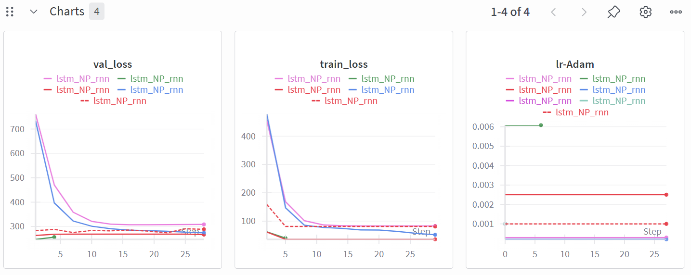
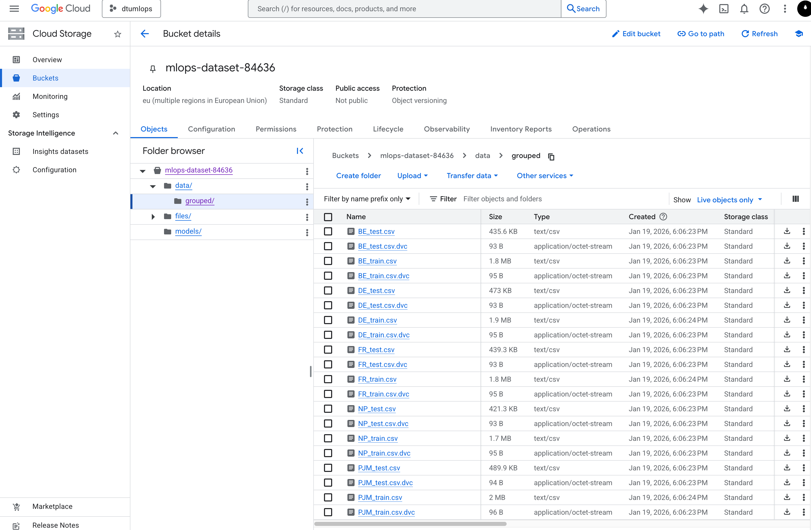
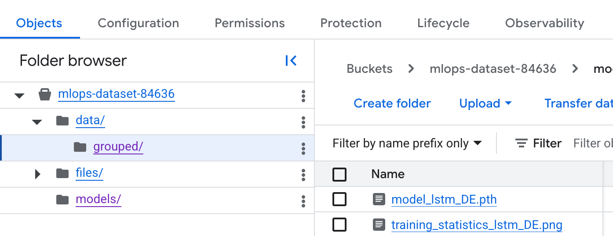
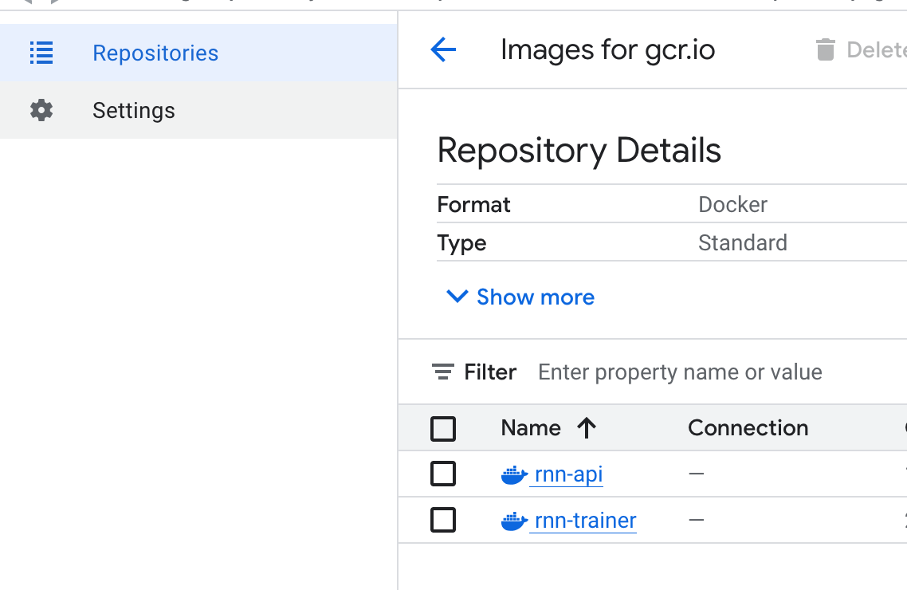
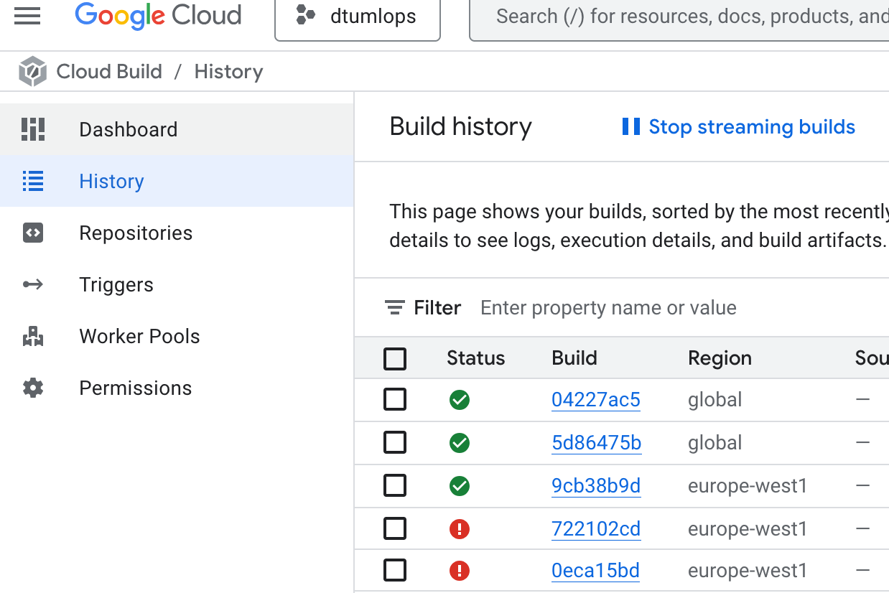

# Exam template for 02476 Machine Learning Operations

This is the report template for the exam. Please only remove the text formatted as with three dashes in front and behind
like:

```--- question 1 fill here ---```

Where you instead should add your answers. Any other changes may have unwanted consequences when your report is
auto-generated at the end of the course. For questions where you are asked to include images, start by adding the image
to the `figures` subfolder (please only use `.png`, `.jpg` or `.jpeg`) and then add the following code in your answer:

``

In addition to this markdown file, we also provide the `report.py` script that provides two utility functions:

Running:

```bash
python report.py html
```

Will generate a `.html` page of your report. After the deadline for answering this template, we will auto-scrape
everything in this `reports` folder and then use this utility to generate a `.html` page that will be your serve
as your final hand-in.

Running

```bash
python report.py check
```

Will check your answers in this template against the constraints listed for each question e.g. is your answer too
short, too long, or have you included an image when asked. For both functions to work you mustn't rename anything.
The script has two dependencies that can be installed with

```bash
pip install typer markdown
```

or

```bash
uv add typer markdown
```

## Overall project checklist

The checklist is *exhaustive* which means that it includes everything that you could do on the project included in the
curriculum in this course. Therefore, we do not expect at all that you have checked all boxes at the end of the project.
The parenthesis at the end indicates what module the bullet point is related to. Please be honest in your answers, we
will check the repositories and the code to verify your answers.

### Week 1

* [x] Create a git repository (M5)
* [x] Make sure that all team members have write access to the GitHub repository (M5)
* [x] Create a dedicated environment for you project to keep track of your packages (M2)
* [x] Create the initial file structure using cookiecutter with an appropriate template (M6)
* [x] Fill out the `data.py` file such that it downloads whatever data you need and preprocesses it (if necessary) (M6)
* [x] Add a model to `model.py` and a training procedure to `train.py` and get that running (M6)
* [x] Remember to either fill out the `requirements.txt`/`requirements_dev.txt` files or keeping your
    `pyproject.toml`/`uv.lock` up-to-date with whatever dependencies that you are using (M2+M6)
* [x] Remember to comply with good coding practices (`pep8`) while doing the project (M7)
* [x] Do a bit of code typing and remember to document essential parts of your code (M7)
* [ ] Setup version control for your data or part of your data (M8)
* [x] Add command line interfaces and project commands to your code where it makes sense (M9)
* [x] Construct one or multiple docker files for your code (M10)
* [x] Build the docker files locally and make sure they work as intended (M10)
* [x] Write one or multiple configurations files for your experiments (M11)
* [x] Used Hydra to load the configurations and manage your hyperparameters (M11)
* [ ] Use profiling to optimize your code (M12)
* [x] Use logging to log important events in your code (M14)
* [x] Use Weights & Biases to log training progress and other important metrics/artifacts in your code (M14)
* [x] Consider running a hyperparameter optimization sweep (M14)
* [x] Use PyTorch-lightning (if applicable) to reduce the amount of boilerplate in your code (M15)

### Week 2

* [x] Write unit tests related to the data part of your code (M16)
* [x] Write unit tests related to model construction and or model training (M16)
* [x] Calculate the code coverage (M16)
* [y] Get some continuous integration running on the GitHub repository (M17)
* [ ] Add caching and multi-os/python/pytorch testing to your continuous integration (M17)
* [x] Add a linting step to your continuous integration (M17)
* [x] Add pre-commit hooks to your version control setup (M18)
* [ ] Add a continues workflow that triggers when data changes (M19)
* [ ] Add a continues workflow that triggers when changes to the model registry is made (M19)
* [x] Create a data storage in GCP Bucket for your data and link this with your data version control setup (M21)
* [ ] Create a trigger workflow for automatically building your docker images (M21)
* [x] Get your model training in GCP using either the Engine or Vertex AI (M21)
* [x] Create a FastAPI application that can do inference using your model (M22)
* [x] Deploy your model in GCP using either Functions or Run as the backend (M23)
* [x] Write API tests for your application and setup continues integration for these (M24)
* [x] Load test your application (M24)
* [ ] Create a more specialized ML-deployment API using either ONNX or BentoML, or both (M25)
* [ ] Create a frontend for your API (M26)

### Week 3

* [ ] Check how robust your model is towards data drifting (M27)
* [ ] Setup collection of input-output data from your deployed application (M27)
* [ ] Deploy to the cloud a drift detection API (M27)
* [ ] Instrument your API with a couple of system metrics (M28)
* [ ] Setup cloud monitoring of your instrumented application (M28)
* [x] Create one or more alert systems in GCP to alert you if your app is not behaving correctly (M28)
* [ ] If applicable, optimize the performance of your data loading using distributed data loading (M29)
* [ ] If applicable, optimize the performance of your training pipeline by using distributed training (M30)
* [ ] Play around with quantization, compilation and pruning for you trained models to increase inference speed (M31)

### Extra

* [x] Write some documentation for your application (M32)
* [x] Publish the documentation to GitHub Pages (M32)
* [x] Revisit your initial project description. Did the project turn out as you wanted?
* [ ] Create an architectural diagram over your MLOps pipeline
* [x] Make sure all group members have an understanding about all parts of the project
* [x] Uploaded all your code to GitHub

## Group information

### Question 1
> **Enter the group number you signed up on <learn.inside.dtu.dk>**
>
> Answer:

Group 57

### Question 2
> **Enter the study number for each member in the group**
>
> Example:
>
> *sXXXXXX, sXXXXXX, sXXXXXX*
>
> Answer:

s234870, s234868, s225181, s225676, s224276

### Question 3
> **Did you end up using any open-source frameworks/packages not covered in the course during your project? If so**
> **which did you use and how did they help you complete the project?**
>
> Recommended answer length: 0-200 words.
>
> Example:
> *We used the third-party framework ... in our project. We used functionality ... and functionality ... from the*
> *package to do ... and ... in our project*.
>
> Answer:

--- question 3 fill here ---

## Coding environment

> In the following section we are interested in learning more about you local development environment. This includes
> how you managed dependencies, the structure of your code and how you managed code quality.

### Question 4

> **Explain how you managed dependencies in your project? Explain the process a new team member would have to go**
> **through to get an exact copy of your environment.**
>
> Recommended answer length: 100-200 words
>
> Example:
> *We used ... for managing our dependencies. The list of dependencies was auto-generated using ... . To get a*
> *complete copy of our development environment, one would have to run the following commands*
>
> Answer:

To guarantee everyone were working with as identical as possible coding environments, we made use of UV. Through a quick installation - Even just using pip - and using basic UV commands, you can be up to date the the current developments. Additionally, UV is also utilized to create new requirement files, making UV a helpful option that speeds up development and helping guaranteeing consistency - Recommended, but only optional.

### Question 5

> **We expect that you initialized your project using the cookiecutter template. Explain the overall structure of your**
> **code. What did you fill out? Did you deviate from the template in some way?**
>
> Recommended answer length: 100-200 words
>
> Example:
> *From the cookiecutter template we have filled out the ... , ... and ... folder. We have removed the ... folder*
> *because we did not use any ... in our project. We have added an ... folder that contains ... for running our*
> *experiments.*
>
> Answer:

Our cookiecutter template has a few changes from the primary cookiecutter template, namely that the SRC contains purely the machine learning model itself. While we might tap back into the model, it is the only major deviation.

### Question 6

> **Did you implement any rules for code quality and format? What about typing and documentation? Additionally,**
> **explain with your own words why these concepts matters in larger projects.**
>
> Recommended answer length: 100-200 words.
>
> Example:
> *We used ... for linting and ... for formatting. We also used ... for typing and ... for documentation. These*
> *concepts are important in larger projects because ... . For example, typing ...*
>
> Answer:

We utilized ruff for linting, pep8 for good coding formatting, and mypy for type checking. Especially in larger projects, it can be important to understand how code works and interacts, especially when a new colleague comes in, or a dusty function has to be updated, so that you don't spend 20 hours thinking "What the ..."

## Version control

> In the following section we are interested in how version control was used in your project during development to
> corporate and increase the quality of your code.

### Question 7

> **How many tests did you implement and what are they testing in your code?**
>
> Recommended answer length: 50-100 words.
>
> Example:
> *In total we have implemented X tests. Primarily we are testing ... and ... as these the most critical parts of our*
> *application but also ... .*
>
> Answer:

In total we have implemented 12 tests across unit, integration, and performance testing. We have 6 unit tests for data processing and model functionality. We have 3 integration tests for our FastAPI endpoints. Additionally, we implemented 2 load testing tasks using Locust to test API performance under concurrent user load. All these can be found in \test

### Question 8

> **What is the total code coverage (in percentage) of your code? If your code had a code coverage of 100% (or close**
> **to), would you still trust it to be error free? Explain you reasoning.**
>
> Recommended answer length: 100-200 words.
>
> Example:
> *The total code coverage of code is X%, which includes all our source code. We are far from 100% coverage of our **
> *code and even if we were then...*
>
> Answer:

As I am writing this the code coverage lies on 30%, which of course is far from the 100% to be aimed at. However - We do not necessarily agree that a code coverage of 100% means we can trust the code to be error free. It is important to have 'high quality'-tests, that are able to truly test and identify any issues that might appear. We could go in and implement some very simple tests that just checks if the code runs - However, that might not be a good indication, if it runs, but does not produce meaningful results.

### Question 9

> **Did you workflow include using branches and pull requests? If yes, explain how. If not, explain how branches and**
> **pull request can help improve version control.**
>
> Recommended answer length: 100-200 words.
>
> Example:
> *We made use of both branches and PRs in our project. In our group, each member had an branch that they worked on in*
> *addition to the main branch. To merge code we ...*
>
> Answer:

Yes, we started with utilizing branches, and eventually also included pull requests. Branches were agreed upon to be used for new implementations (e.g. module X and Y, or "New Feature"), this meant that if necessary, we could observe what the others were in the middle of, and pull it if necessary, without horizontal interferance. Additionally, when code was pushed/merged to the main, we utilized the tests and workflows, to guarantee a new user would be able to run the code - As well as quality of life, keeping the expression of the code to a high(er) standard than we normally might.

### Question 10

> **Did you use DVC for managing data in your project? If yes, then how did it improve your project to have version**
> **control of your data. If no, explain a case where it would be beneficial to have version control of your data.**
>
> Recommended answer length: 100-200 words.
>
> Example:
> *We did make use of DVC in the following way: ... . In the end it helped us in ... for controlling ... part of our*
> *pipeline*
>
> Answer:

As I am writing this, we have not fully utilized DVC for properly managing our data. While we discussed it during cloud solution it remains to be implemented.
However, DVC can be instrumental in cases where you have enourmes amounts of data that you want to store and organize. In our case, the data is rather manegable, and we'd have to scale up our datapool monumentally (we have every hour by hour energy price/production/expected_consumption for 5 powergrids, some back from 2010), so it seemed excessive for us to implement DVC, for something that can be stored anywhere, and even downloaded to anywhere.

### Question 11

> **Discuss you continuous integration setup. What kind of continuous integration are you running (unittesting,**
> **linting, etc.)? Do you test multiple operating systems, Python  version etc. Do you make use of caching? Feel free**
> **to insert a link to one of your GitHub actions workflow.**
>
> Recommended answer length: 200-300 words.
>
> Example:
> *We have organized our continuous integration into 3 separate files: one for doing ..., one for running ... testing*
> *and one for running ... . In particular for our ..., we used ... .An example of a triggered workflow can be seen*
> *here: <weblink>*
>
> Answer:

We are utilizing GitHub actions for the continous integration, featuring both workflows for linting and testing. This is forced on pushes and merges that target the main branch. For the operating systems we test the 3 major operating systems; Windows, MacOS and Ubuntu, that should ensure compatibility across most platforms. And for the test we do Python versioning, that tests the Python installation by installing the uv package manager, setting up the environment and runs the basic tests and reporting coverage. Additionally we also implemented the linting workflow, which simply checks linting and formatting utilizing ruff on src and test directories.

## Running code and tracking experiments

> In the following section we are interested in learning more about the experimental setup for running your code and
> especially the reproducibility of your experiments.

### Question 12

> **How did you configure experiments? Did you make use of config files? Explain with coding examples of how you would**
> **run a experiment.**
>
> Recommended answer length: 50-100 words.
>
> Example:
> *We used a simple argparser, that worked in the following way: Python  my_script.py --lr 1e-3 --batch_size 25*
>
> Answer:

We have made use of both hydra config files, which allows us to maintain a 'standard' of how the models use, as well as a simple argparser that can override the hydra configs, together with command line implementation the user can simply write "(Python // uv run) train" to have the model start running. We are currently looking into package installations as well, to reduce it further.

### Question 13

> **Reproducibility of experiments are important. Related to the last question, how did you secure that no information**
> **is lost when running experiments and that your experiments are reproducible?**
>
> Recommended answer length: 100-200 words.
>
> Example:
> *We made use of config files. Whenever an experiment is run the following happens: ... . To reproduce an experiment*
> *one would have to do ...*
>
> Answer:

We primarily utilized config files, which means a lot of standard hyperparameters are kept the same, unless the standard hyperparameters are overwritten. Additionally the hydraconfig files will generate a log file locally, so the user can figure out exactly what configurations were utilized at what date.

### Question 14

> **Upload 1 to 3 screenshots that show the experiments that you have done in W&B (or another experiment tracking**
> **service of your choice). This may include loss graphs, logged images, hyperparameter sweeps etc. You can take**
> **inspiration from [this figure](figures/wandb.png). Explain what metrics you are tracking and why they are**
> **important.**
>
> Recommended answer length: 200-300 words + 1 to 3 screenshots.
>
> Example:
> *As seen in the first image when have tracked ... and ... which both inform us about ... in our experiments.*
> *As seen in the second image we are also tracking ... and ...*
>
> Answer:



On the first image, it can be seen that we have implementing tracking for basic experimental performance. Logging MSE training/validation loss, as well as other basic peromance metricles for our experiments.


Additionally, which can be seen here on the latter image, we also agreed upon implementing a sweep function, which allows us the run sweeps of the models, utilizing a bayesian optimizer. While it has not been ran a sufficient amount of times, it can be ran for however long desired, or until no better hyperparameters can be found.

### Question 15

> **Docker is an important tool for creating containerized applications. Explain how you used docker in your**
> **experiments/project? Include how you would run your docker images and include a link to one of your docker files.**
>
> Recommended answer length: 100-200 words.
>
> Example:
> *For our project we developed several images: one for training, inference and deployment. For example to run the*
> *training docker image: `docker run trainer:latest lr=1e-3 batch_size=64`. Link to docker file: <weblink>*
>
> Answer:

For our project we developed a multi-stage Docker setup with two images: one for training and one for API deployment. Both images share a common base that installs dependencies using "uv" and copies the source code. The trainer image includes the data directory and runs the RNN training script, while the API image sets up a FastAPI server that can load models either locally or from GCS.

To run locally: "make train-local" for training or "make deploy-local" for the API . For cloud deployment: "make train-cloud" or "make deploy-cloud" . Our Docker setup uses platform detection to build native images locally and AMD64 images for cloud deployment.
### Question 16

> **When running into bugs while trying to run your experiments, how did you perform debugging? Additionally, did you**
> **try to profile your code or do you think it is already perfect?**
>
> Recommended answer length: 100-200 words.
>
> Example:
> *Debugging method was dependent on group member. Some just used ... and others used ... . We did a single profiling*
> *run of our main code at some point that showed ...*
>
> Answer:

--- question 16 fill here ---

## Working in the cloud

> In the following section we would like to know more about your experience when developing in the cloud.

### Question 17

> **List all the GCP services that you made use of in your project and shortly explain what each service does?**
>
> Recommended answer length: 50-200 words.
>
> Example:
> *We used the following two services: Engine and Bucket. Engine is used for... and Bucket is used for...*
>
> Answer:

We used Cloud Storage Bucket to store our data and models. We used the python package dvc-gcp to link our data version control with our GCP bucket.
We stored our train and api images in Artifact Registry, which is GCP's docker image storage service.
Cloud Build was used to automatically build our docker images and deploy them when code is pushed to the repository.
Vertex AI was used to train our models in the cloud using our docker images. The trained models were then pushed back to our Bucket.
Cloud Run was used to deploy our trained model as an API using our api docker image.

### Question 18

> **The backbone of GCP is the Compute engine. Explained how you made use of this service and what type of VMs**
> **you used?**
>
> Recommended answer length: 100-200 words.
>
> Example:
> *We used the compute engine to run our ... . We used instances with the following hardware: ... and we started the*
> *using a custom container: ...*
>
> Answer:

We did not directly use Compute Engine in our project. Instead, we used Vertex AI to handle the training of our models and Cloud Run to deploy our API. Both of these services run on top of Compute Engine, but they abstract away the need for us to manage individual virtual machines directly. For Vertex AI training, we used the N1-standard-4 machine type, which provided 4 vCPUs and 15GB of memory which was enough CPU and memory for our training workload. We used our custom trainer docker image in Vertex AI with a config file (vertex_config.yaml) that specified startup commands, model hyperparameters, and data locations in GCS.

### Question 19

> **Insert 1-2 images of your GCP bucket, such that we can see what data you have stored in it.**
> **You can take inspiration from [this figure](figures/bucket.png).**
>
> Answer:




### Question 20

> **Upload 1-2 images of your GCP artifact registry, such that we can see the different docker images that you have**
> **stored. You can take inspiration from [this figure](figures/registry.png).**
>
> Answer:



### Question 21

> **Upload 1-2 images of your GCP cloud build history, so we can see the history of the images that have been build in**
> **your project. You can take inspiration from [this figure](figures/build.png).**
>
> Answer:



### Question 22

> **Did you manage to train your model in the cloud using either the Engine or Vertex AI? If yes, explain how you did**
> **it. If not, describe why.**
>
> Recommended answer length: 100-200 words.
>
> Example:
> *We managed to train our model in the cloud using the Engine. We did this by ... . The reason we choose the Engine*
> *was because ...*
>
> Answer:

We trained our model using Vertex AI. After a bit of googling and asking AI models, we chose Vertex AI because it seemed like the more mature platform and the type of platform we would use in future projects or professional work. It was probably a bit "overkill" for our simple model and dataset, but it was a good learning experience.
We created a docker image for training our model and pushed it to GCP Artifact Registry. We used a simple config file that created a custom training job that used our docker image and specified the necessary parameters such as machine type, region, and data locations. Once the job was started, Vertex AI handled the provisioning of resources and execution of the training job in the cloud. After training, the model was saved to our GCP bucket.

## Deployment

### Question 23

> **Did you manage to write an API for your model? If yes, explain how you did it and if you did anything special. If**
> **not, explain how you would do it.**
>
> Recommended answer length: 100-200 words.
>
> Example:
> *We did manage to write an API for our model. We used FastAPI to do this. We did this by ... . We also added ...*
> *to the API to make it more ...*
>
> Answer:

We created a backend API for our model using FastAPI since we've worked with a it before and found it easy to use. The API has two endpoints: a root endpoint that returns a message along with the model information, and a predict endpoint that accepts POST requests with input data in JSON format. The predict endpoint preprocesses the input data, runs it through the trained model, and returns the predictions in JSON format. We also added error handling to return appropriate error messages for invalid inputs.
On startup it either loads a local model file or downloads the model from our GCP bucket if deployed in the cloud. For a production system we would add authentication and logging to the API.

### Question 24

> **Did you manage to deploy your API, either in locally or cloud? If not, describe why. If yes, describe how and**
> **preferably how you invoke your deployed service?**
>
> Recommended answer length: 100-200 words.
>
> Example:
> *For deployment we wrapped our model into application using ... . We first tried locally serving the model, which*
> *worked. Afterwards we deployed it in the cloud, using ... . To invoke the service an user would call*
> *`curl -X POST -F "file=@file.json"<weburl>`*
>
> Answer:

We deployed our API both locally and in the cloud. For local deployment, we used Docker to containerize our FastAPI application, which we could run with a simple make command. For cloud deployment, we used GCP Cloud Run. Our cloudbuild.yaml automates the entire process: building the docker image, pushing it to Artifact Registry, and deploying to Cloud Run. The API downloads the trained model from our GCS bucket at startup. To invoke the deployed service, a user would call `curl -X POST -H "Content-Type: application/json" -d '{"features": [[10.0, 50.0, 20.0], ...]}' https://rnn-api-<hash>-ew.a.run.app/predict`.
If this was a production setting we would add authentication and logging to the API.

### Question 25

> **Did you perform any unit testing and load testing of your API? If yes, explain how you did it and what results for**
> **the load testing did you get. If not, explain how you would do it.**
>
> Recommended answer length: 100-200 words.
>
> Example:
> *For unit testing we used ... and for load testing we used ... . The results of the load testing showed that ...*
> *before the service crashed.*
>
> Answer:

--- question 25 fill here ---

### Question 26

> **Did you manage to implement monitoring of your deployed model? If yes, explain how it works. If not, explain how**
> **monitoring would help the longevity of your application.**
>
> Recommended answer length: 100-200 words.
>
> Example:
> *We did not manage to implement monitoring. We would like to have monitoring implemented such that over time we could*
> *measure ... and ... that would inform us about this ... behaviour of our application.*
>
> Answer:

We implemented basic monitoring and alerting for our deployed API. Cloud Run automatically provides monitoring dashboards that track request counts, response times, error rates, and resource usage (CPU/memory). We set up email alerts through GCP Cloud Monitoring that notify us whenever the API returns 5xx errors, so we get immediately informed if something breaks in production.

For a more robust production system, we would add custom monitoring to track model-specific metrics like prediction distributions, input data statistics, and inference times. We would also implement data drift detection to monitor if the input data distribution changes over time, which could degrade model performance. This would require collecting and storing prediction inputs over time, which we didn't implement in this project.

## Overall discussion of project

> In the following section we would like you to think about the general structure of your project.

### Question 27

> **How many credits did you end up using during the project and what service was most expensive? In general what do**
> **you think about working in the cloud?**
>
> Recommended answer length: 100-200 words.
>
> Example:
> *Group member 1 used ..., Group member 2 used ..., in total ... credits was spend during development. The service*
> *costing the most was ... due to ... . Working in the cloud was ...*
>
> Answer:

Our expenses was quite low, as we primarily used free-tier services and our model training was fast. Group member S234868 used approximately $1. Cloud build were the most expensive service, as it built and deployed our docker images multiple times during development. Cloud Run was set to scale down to zero when not in use causing cold starts but keeping costs low. Vertex AI took about 10-15 minutes to load up and train our model.
The cost was as follows:

- Cloud Build: $0.59
- Artifiact Registry: $0.33
- Vertex AI: $0.09
- Cloud Run: $0.01


Working in the cloud was generally a positive experience. It did cause more errors compared to local development, for example some eu region did not have certain compute types available or docker images had to be built in a certain way to work in GCP.
### Question 28

> **Did you implement anything extra in your project that is not covered by other questions? Maybe you implemented**
> **a frontend for your API, use extra version control features, a drift detection service, a kubernetes cluster etc.**
> **If yes, explain what you did and why.**
>
> Recommended answer length: 0-200 words.
>
> Example:
> *We implemented a frontend for our API. We did this because we wanted to show the user ... . The frontend was*
> *implemented using ...*
>
> Answer:

--- question 28 fill here ---

### Question 29

> **Include a figure that describes the overall architecture of your system and what services that you make use of.**
> **You can take inspiration from [this figure](figures/overview.png). Additionally, in your own words, explain the**
> **overall steps in figure.**
>
> Recommended answer length: 200-400 words
>
> Example:
>
> *The starting point of the diagram is our local setup, where we integrated ... and ... and ... into our code.*
> *Whenever we commit code and push to GitHub, it auto triggers ... and ... . From there the diagram shows ...*
>
> Answer:

--- question 29 fill here ---

### Question 30

> **Discuss the overall struggles of the project. Where did you spend most time and what did you do to overcome these**
> **challenges?**
>
> Recommended answer length: 200-400 words.
>
> Example:
> *The biggest challenges in the project was using ... tool to do ... . The reason for this was ...*
>
> Answer:

--- question 30 fill here ---

### Question 31

> **State the individual contributions of each team member. This is required information from DTU, because we need to**
> **make sure all members contributed actively to the project. Additionally, state if/how you have used generative AI**
> **tools in your project.**
>
> Recommended answer length: 50-300 words.
>
> Example:
> *Student sXXXXXX was in charge of developing of setting up the initial cookie cutter project and developing of the*
> *docker containers for training our applications.*
> *Student sXXXXXX was in charge of training our models in the cloud and deploying them afterwards.*
> *All members contributed to code by...*
> *We have used ChatGPT to help debug our code. Additionally, we used GitHub Copilot to help write some of our code.*
> Answer:

We confirm that during the project we have utilized generative AI for this project, such as GitHub Copilot, as recommended in the course material. The tasks for which AI was utilized ranged from research to troubleshooting, to clarifications.
